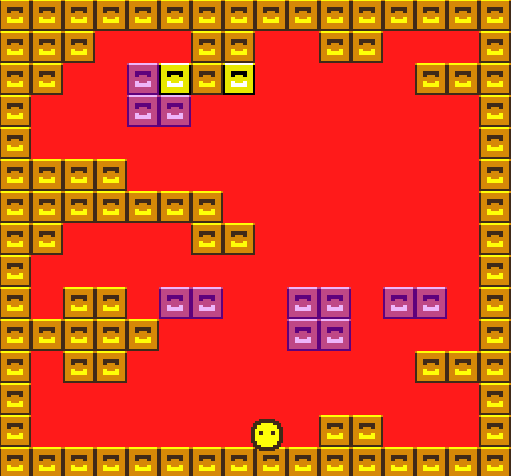

# MIDAS

Author: Alton Olson

Design: An arcade-style platformer where you try to touch every "island" of tiles in the room.

Screen Shot:

How Your Asset Pipeline Works:

I wrote a program called asset_converter that reads in a png image and converts the contents to palette and tile data. The data is stored in the same format in memory as it would be in the PPU466, and then is written directly to a chunked file which is then read directly into the same structures in memory.

How To Play:

Use the arrow keys to move and jump. Press space if you need to skip a room.

Sources: none

This game was built with [NEST](NEST.md).

